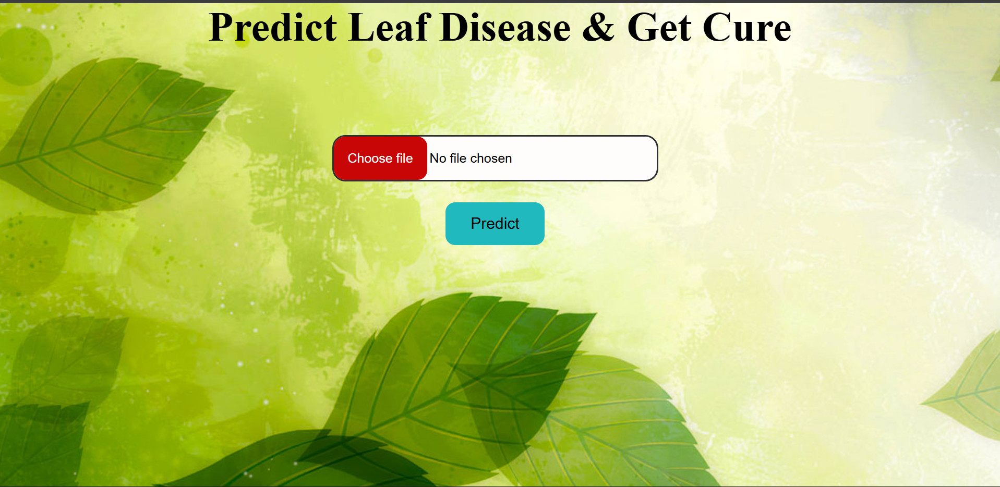

# 🍃 Plant Leaf Disease Detection System


> An end-to-end Machine Learning web application designed to help farmers and agricultural researchers identify plant diseases from leaf images.

---

## 📖 Table of Contents
- [About the Project](#about-the-project)
- [Key Features](#key-features)
- [Supported Classes](#supported-classes)
- [Project Architecture](#project-architecture)
- [Installation & Setup](#installation--setup)
- [Usage](#usage)
- [Dataset](#dataset)
- [Future Enhancements](#future-enhancements)

---

## 🎯 About the Project

Plant diseases are a major threat to food security and agricultural economy. This project leverages Deep Learning—specifically a Convolutional Neural Network (VGG16/VGG19)—to automate the detection of leaf diseases across multiple crop species. 

The core model is integrated into a lightweight **Flask web application**, allowing users to easily upload a photo of a leaf and receive an instant diagnosis along with recommended solutions.

### Screenshots



---

## ✨ Key Features
*   **High Accuracy:** Built on the robust VGG architecture.
*   **Broad Detection:** Identifies 38 distinct plant disease classes.
*   **Web Interface:** Easy-to-use frontend built with HTML/CSS and Flask.
*   **Actionable Insights:** Returns specific disease names (e.g., *Tomato - Early Blight*).

---

## 🌱 Supported Classes
The model can identify diseases across several major crops, including but not limited to:
*   **Apple:** Scab, Black Rot, Cedar Rust, Healthy
*   **Corn:** Grey Leaf Spot, Common Rust, Northern Leaf Blight, Healthy
*   **Grape:** Black Rot, Esca, Leaf Blight, Healthy
*   **Tomato:** Bacterial Spot, Early Blight, Late Blight, Leaf Mold, Septoria Leaf Spot, Target Spot, Mosaic Virus, Healthy
*   *(And more: Cherry, Peach, Pepper, Potato, Raspberry, Soybean, Squash, Strawberry)*

---

## 🏗️ Project Architecture
```text
MiniProject/
│
├── app.py                  # The main Flask application server
├── best_model1.h5          # The trained Keras/TensorFlow model
├── requirements.txt        # Python dependency list
│
├── static/                 # Static web assets
│   ├── css/                # Stylesheets for the UI
│   ├── images/             # Sample/test images
│   └── upload/             # Temporary storage for user uploads
│
└── templates/              # HTML files rendered by Flask
    ├── index.html          # The main upload interface
    ├── Apple-Scab.html     # Disease-specific result pages
    └── ...                 # (37 other result pages)

